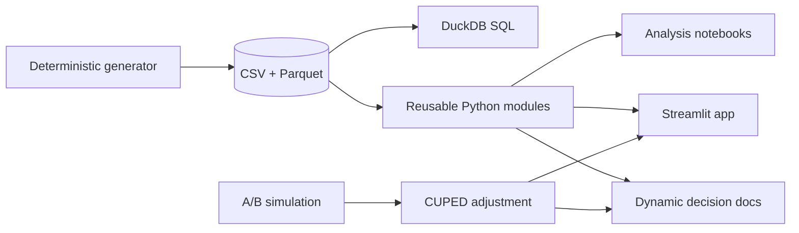

# Marketplace Growth & Pricing Intelligence Platform

[](https://python.org) [](https://streamlit.io) [](https://duckdb.org) [](https://plotly.com)

An end-to-end analytics portfolio project that diagnoses a two-sided marketplace GMV slowdown, traces it to seller supply and search discovery, proposes a fulfillment-aware ranking intervention, and validates that intervention using a reusable CUPED implementation. The repository combines 320K related search events, 41K transactions, production-style SQL, statistical analysis, decision documents, and a three-tab Streamlit dashboard.

> **Live app:** `https://YOUR-APP.streamlit.app` (replace after deployment)

## Architecture



## Key findings

- Monthly GMV fell **-21.6%** over the final three-month window, a **-$52,517** change; buyer-count mechanics contributed -$44,108.
- Search has a clear rank cliff at **position 11**: ranks 1–5 contribute **17.09% CTR**, while ranks below 10 contribute only **1.91%**.
- Sellers below 90% fulfillment churn at **33.4%**, versus **7.6%** above the threshold.
- The default experiment's historical covariate reduces outcome variance by **3.6%**; its CUPED p-value is **0.3379** versus **0.3451** naively.

> **CUPED in one minute**  
> CUPED subtracts the portion of an experiment outcome predicted by a pre-experiment covariate. Here, historical buyer purchase propensity explains some otherwise noisy conversion variation. The adjusted metric keeps the treatment effect unbiased under randomization while reducing variance, which can tighten confidence intervals and increase effective power without adding traffic. The implementation in `src/ab_test_cuped.py` computes θ = Cov(Y, X) / Var(X) from scratch.

## Repository map

- `src/`: reusable generation, marketplace, search, and experiment functions
- `sql/`: GMV decomposition, search funnel, and seller-health queries
- `notebooks/`: business, product, and experimentation walkthroughs
- `docs/`: dynamically generated executive memo, PRD, and experiment readout
- `app/streamlit_app.py`: interactive decision dashboard
- `data/build_artifacts.py`: single source for all reported metrics and markdown

## Run locally

```bash
python -m venv .venv
# Windows PowerShell: .venv\Scripts\Activate.ps1
pip install -r requirements.txt
python data/generate_data.py
python data/build_artifacts.py
streamlit run app/streamlit_app.py
```

The generator writes both CSV and Parquet. Re-running `build_artifacts.py` refreshes every number in the docs, notebooks, derived extracts, and this README from the current data.
